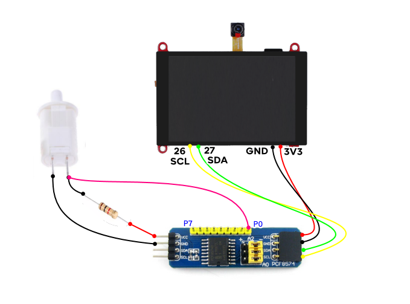
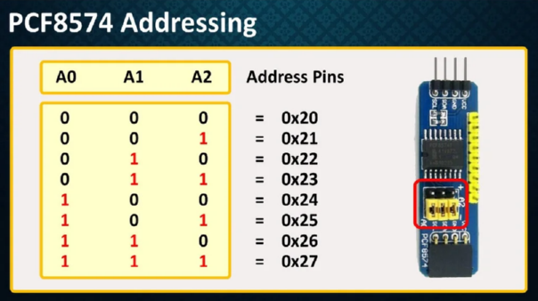

# BlynkGO_PCF8574_Button
 Button by event  on PCF8574 I/O expander I2C
  
<p align="left">
  
</p>  

## PCF8574 I2C Address
  
<p align="left">
  
</p>  


## Example

```cpp
#include <PCF8574.h>                       // https://github.com/xreef/PCF8574_library
#include "BlynkGO_PCF8574_Button.h"

PCF8574 pcf8574(0x20);
PCF8574_Button button(pcf8574, P0);
//PCF8574_Button button(pcf8574, P0, LOW); // หาก ปุ่มกด เมื่อมีการกดมีสถานะเป็น LOW

void setup() {
  Serial.begin(115200); Serial.println();
  pcf8574.pinMode(P0, INPUT);
  if (!pcf8574.begin()){
    Serial.println("[PCF8574] failed");
    return;
  }
  
  button.onPressed([](PCF8574_Button* btn){
    Serial.println("[Button] Pressed");
  });

  button.onPressing([](PCF8574_Button* btn){
    Serial.println("[Button] Pressing");
  });

  button.onLongPressed(1200,[](PCF8574_Button* btn){
    Serial.println("[Button] Long Pressed");
  });

  button.onReleased([](PCF8574_Button* btn){
    Serial.println("[Button] Released");
  });
  
  button.onClicked([](PCF8574_Button* btn){
    Serial.println("[Button] Clicked");
  });
}

void loop() {
  button.loop();
}

```
  
  
Friday 24/06/2022  
BlynkGO  
